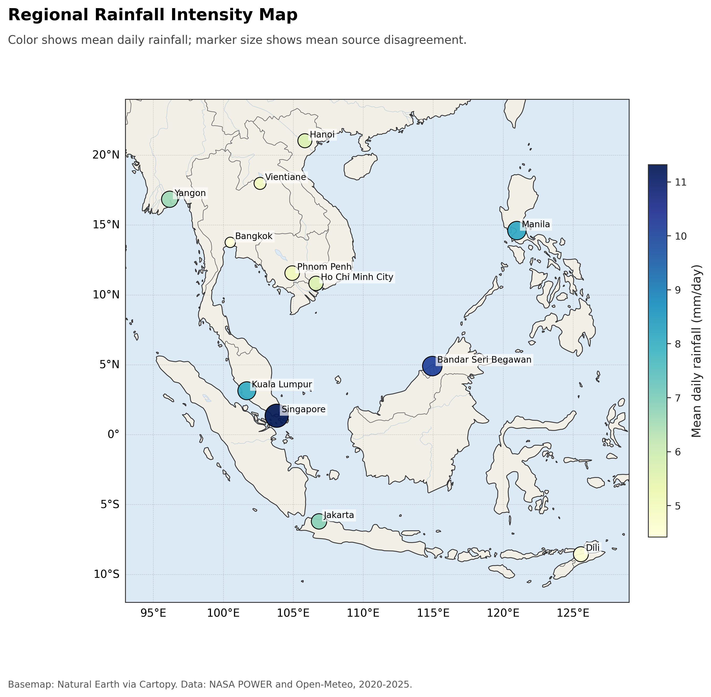
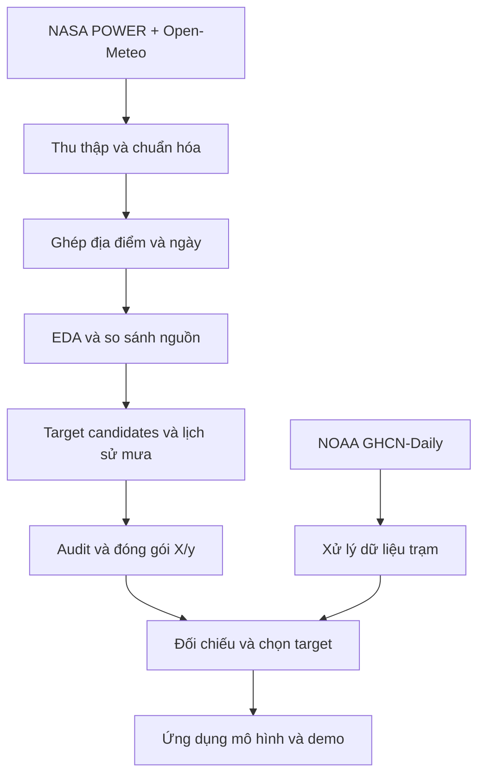
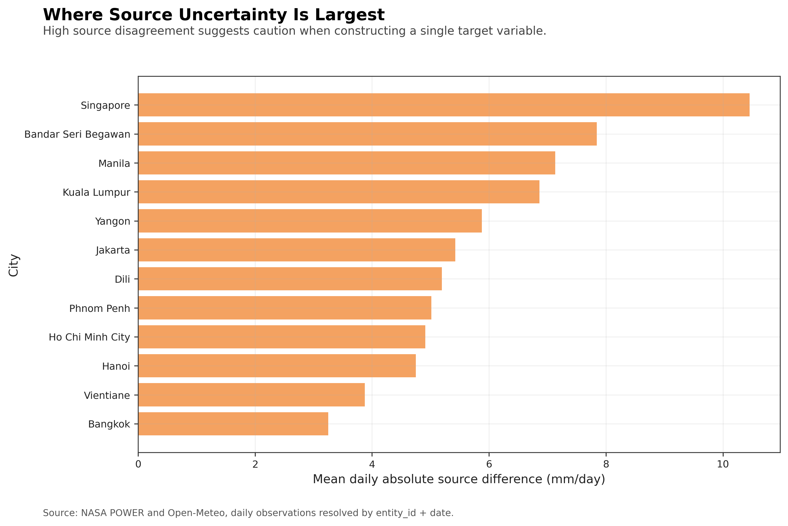

<div align="center">

# Southeast Asia Rainfall Data Pipeline

**Thu thập, tích hợp và kiểm tra dữ liệu mưa đa nguồn cho 12 thành phố Đông Nam Á, giai đoạn 2020–2025**


[**Quy trình xử lý**](#4-quy-trình-thực-hiện) · [**Bộ dữ liệu đầu ra**](#8-đóng-gói-dữ-liệu-và-kiểm-tra-leakage) · [**Báo cáo EDA**](reports/02_EDA_report/EDA_CONCLUSIONS_AND_NEXT_STEPS.md) · [**Cách chạy**](#11-cách-sử-dụng-và-tái-lập)



<sub>Hình 1. Tổng quan dữ liệu 2020–2025. Màu biểu diễn lượng mưa trung bình ngày; kích thước điểm biểu diễn mức chênh lệch trung bình giữa hai nguồn. Đây là hình EDA của bộ dữ liệu, không phải bản đồ dự báo.</sub>

</div>

> [!NOTE]
> Trọng tâm của đề tài là xử lý dữ liệu: dữ liệu đến từ đâu, hai nguồn khác nhau như thế nào, cần biến đổi ra sao và có thể sử dụng đến mức nào. Notebook huấn luyện và web demo là phần ứng dụng tiếp theo của bộ dữ liệu đã xây dựng.

---

## Đọc nhanh dự án

| Thành phần | Kết quả đã lưu |
|---|---|
| Phạm vi | 12 thành phố, 2.192 ngày, từ 01/01/2020 đến 31/12/2025 |
| Hai nguồn chính | NASA POWER Daily và Open-Meteo Historical Weather |
| Dữ liệu nguồn dạng dài | 52.608 dòng, giữ riêng từng nguồn |
| Sau tích hợp | 26.304 dòng theo khóa `entity_id + date` |
| Dữ liệu processed | 26.304 dòng × 60 cột |
| Bộ X cho dự báo bằng lịch sử | 24 feature, kèm 6 cột định danh và metadata |
| Bộ y riêng | 5 phương án target, kèm 6 cột định danh và metadata |
| Nguồn tham chiếu bổ sung | Trạm mưa NOAA GHCN-Daily, dùng để so sánh target |
| Khả năng truy vết | Phản hồi API gốc, bảng ánh xạ địa điểm, schema, bảng audit và manifest |

Có thể xem ngay [báo cáo thu thập](reports/01_data_collection_report/DATA_COLLECTION_REPORT.md), [kết luận EDA](reports/02_EDA_report/EDA_CONCLUSIONS_AND_NEXT_STEPS.md) và [bộ dữ liệu đã đóng gói](data/processed/model_ready/) mà không cần chạy mô hình hay web app.

## Mục lục

1. [Bài toán dữ liệu](#1-bài-toán-dữ-liệu)
2. [Nguồn và phạm vi](#2-nguồn-và-phạm-vi)
3. [Thu thập, chuẩn hóa và ghép thực thể](#3-thu-thập-chuẩn-hóa-và-ghép-thực-thể)
4. [Quy trình thực hiện](#4-quy-trình-thực-hiện)
5. [EDA và các quyết định xử lý](#5-eda-và-các-quyết-định-xử-lý)
6. [Xây dựng các phương án target](#6-xây-dựng-các-phương-án-target)
7. [Xử lý chuỗi thời gian](#7-xử-lý-chuỗi-thời-gian)
8. [Đóng gói dữ liệu và kiểm tra leakage](#8-đóng-gói-dữ-liệu-và-kiểm-tra-leakage)
9. [Đối chiếu với dữ liệu trạm](#9-đối-chiếu-với-dữ-liệu-trạm)
10. [Kết quả bàn giao và cấu trúc thư mục](#10-kết-quả-bàn-giao-và-cấu-trúc-thư-mục)
11. [Cách sử dụng và tái lập](#11-cách-sử-dụng-và-tái-lập)
12. [Phần mở rộng: mô hình và web demo](#12-phần-mở-rộng-mô-hình-và-web-demo)
13. [Hạn chế và hướng phát triển](#13-hạn-chế-và-hướng-phát-triển)
14. [Tài liệu và nguồn tham chiếu](#14-tài-liệu-và-nguồn-tham-chiếu)

---

## 1. Bài toán dữ liệu

Cùng một thành phố và một ngày, NASA POWER và Open-Meteo có thể trả về lượng mưa khác nhau. Ghép được hai bảng chưa đủ để xác định giá trị nào nên làm target; lấy trung bình cũng chưa chắc tạo ra một giá trị gần quan trắc hơn.

Đề tài xây dựng một quy trình có thể kiểm tra lại từng bước:

1. Thu thập dữ liệu và giữ lại phản hồi gốc.
2. Chuẩn hóa đơn vị, ánh xạ địa điểm và ghép theo ngày.
3. Kiểm tra độ phủ, giá trị thiếu, bản ghi trùng và mức độ đồng thuận giữa nguồn.
4. Tạo các phương án target và đặc trưng lịch sử, với quy tắc xử lý rõ ràng.
5. Tách dữ liệu theo thời gian, kiểm tra các cột được phép dùng để dự báo và đóng gói X/y.
6. Đối chiếu target với dữ liệu trạm, đồng thời ghi nhận giới hạn của nguồn tham chiếu.

Đầu ra chính là **bộ dữ liệu có schema và hồ sơ xử lý đi kèm**. Mỗi quyết định quan trọng đều có bảng số liệu hoặc notebook để đối chiếu.

## 2. Nguồn và phạm vi

| Nguồn | Vai trò | Dữ liệu sử dụng |
|---|---|---|
| NASA POWER Daily API | Nguồn chính thứ nhất | Mưa, nhiệt độ trung bình/cao nhất/thấp nhất, độ ẩm, gió và áp suất |
| Open-Meteo Historical Weather API | Nguồn chính thứ hai | Các biến tương ứng để tích hợp và so sánh |
| NOAA GHCN-Daily | Tham chiếu độc lập ở bước chọn target | Lượng mưa trạm `PRCP`, metadata, cờ chất lượng và vị trí trạm |

**Phạm vi thời gian:** dữ liệu ngày trong sáu năm 2020–2025, gồm 2.192 ngày. NOAA không có quan trắc hợp lệ cho toàn bộ các ngày và địa điểm trong phạm vi này.

| Quốc gia | Thành phố |
|---|---|
| Việt Nam | Hà Nội, TP. Hồ Chí Minh |
| Thái Lan | Bangkok |
| Singapore | Singapore |
| Malaysia | Kuala Lumpur |
| Indonesia | Jakarta |
| Philippines | Manila |
| Campuchia | Phnom Penh |
| Lào | Vientiane |
| Myanmar | Yangon |
| Brunei | Bandar Seri Begawan |
| Timor-Leste | Dili |

Các địa điểm được quản lý bằng mã `entity_id` và tọa độ chuẩn trong [entity registry](data/raw/sea_rainfall_daily_2020_2025_entity_registry.csv). Bộ dữ liệu đại diện cho các điểm truy vấn này, không bao phủ toàn bộ diện tích hay mọi trạm khí tượng của từng thành phố.

## 3. Thu thập, chuẩn hóa và ghép thực thể

### 3.1. Lưu dữ liệu theo từng lớp

Notebook 01 ghi lại ba dạng dữ liệu, phục vụ các mục đích khác nhau:

| Dạng | Nội dung | Công dụng |
|---|---|---|
| JSONL phản hồi API | 24 phản hồi của lần thu thập đã lưu | Đối chiếu với dữ liệu nhà cung cấp trả về |
| Bảng source observations | 52.608 dòng, mỗi dòng thuộc một nguồn | Giữ thông tin nguồn và các biến đã chuẩn hóa |
| Bảng entity-resolved | 26.304 dòng, hai nguồn đặt cạnh nhau | So sánh theo cùng địa điểm và ngày |

Số dòng kỳ vọng của mỗi nguồn là **12 × 2.192 = 26.304**. Manifest lưu phạm vi ngày, nguồn, số dòng, tóm tắt chất lượng và SHA-256 của các tệp đầu ra.

### 3.2. Chuẩn hóa đơn vị

| Đại lượng | Đơn vị thống nhất |
|---|---|
| Lượng mưa ngày | mm/ngày |
| Nhiệt độ | °C |
| Độ ẩm tương đối | % |
| Tốc độ gió | m/s |
| Áp suất bề mặt | kPa |

Chuẩn hóa được thực hiện trước khi tính chênh lệch hoặc tổng hợp hai nguồn. Dữ liệu trạm NOAA được xử lý riêng ở notebook 06 vì định dạng và quy ước giá trị thiếu khác với hai API.

### 3.3. Entity resolution bằng tọa độ

Tọa độ do API trả về có thể lệch so với tọa độ truy vấn. Notebook dùng khoảng cách **Haversine**, ánh xạ tọa độ nguồn về địa điểm chuẩn gần nhất trong bán kính **50 km**, rồi ghép hai nguồn bằng `entity_id + date`.

Registry giữ cả tọa độ chuẩn, tọa độ nguồn, khoảng cách và phương pháp ánh xạ. Ngưỡng 50 km thuộc bước ghép hai API; việc chọn trạm NOAA ở bước sau dùng quy tắc bán kính riêng.

## 4. Quy trình thực hiện



| Bước | Notebook | Nhiệm vụ chính |
|:---:|---|---|
| 01 | [Data collection](notebooks/01_data_collection.ipynb) | Thu thập API, chuẩn hóa đơn vị, entity resolution và xuất dữ liệu raw |
| 02 | [Data quality EDA](notebooks/02_data_quality_eda.ipynb) | Kiểm tra chất lượng, mùa vụ, phân bố mưa và mức đồng thuận giữa nguồn |
| 03 | [Preprocessing](notebooks/03_preprocessing.ipynb) | Tạo target, hiệu chỉnh bias, đặc trưng thời gian, imputation và temporal split |
| 04 | [Model readiness EDA](notebooks/04_processed_model_readiness_eda.ipynb) | Kiểm tra lại dữ liệu processed, vai trò cột và nguy cơ leakage |
| 05 | [Model-ready packaging](notebooks/05_model_ready_packaging.ipynb) | Tách X/y, xuất schema và kiểm tra thông tin được phép đưa vào X |
| 06 | [Target selection](notebooks/06_target_selection_eda_for_model_training.ipynb) | Xử lý trạm NOAA và so sánh năm target trên train/validation |
| 07 | [Model training](notebooks/07_model_training.ipynb) | Phần mở rộng: sử dụng dữ liệu đã đóng gói để huấn luyện |

Phần xử lý dữ liệu được trình bày trong **notebook 01–06**. Có thể dừng tại đây để xem xét bộ dữ liệu đầu ra mà không chạy notebook 07.

## 5. EDA và các quyết định xử lý

### 5.1. Đủ dữ liệu không đồng nghĩa với hai nguồn đồng thuận

Trong bản dữ liệu đã lưu, các biến chuẩn của hai nguồn không có ô thiếu; không có khóa nguồn bị trùng, khóa entity-date bị trùng sau ghép hay lượng mưa âm. Tuy nhiên, mức chênh lệch giữa hai chuỗi vẫn đáng kể:

| Chỉ số so sánh nguồn | Giá trị |
|---|---:|
| Số cặp địa điểm-ngày | 26.304 |
| Chênh lệch tuyệt đối trung bình, MAE | 5,88 mm/ngày |
| RMSE giữa hai nguồn | 12,38 mm/ngày |
| Tương quan Pearson | 0,420 |
| Đồng thuận nhãn ngày mưa/khô | 80,58% |
| Cohen's kappa cho nhãn ngày mưa/khô | 0,584 |

Nguồn: [bảng so sánh toàn bộ dữ liệu](reports/02_EDA_report/tables/15_source_similarity_metrics_global.csv). Các MAE/RMSE này đo **chênh lệch giữa hai nguồn**, chưa phải sai số so với mưa thực đo.

<p align="center">

<br><sub>Hình 2. Mức bất đồng thay đổi theo địa điểm; Singapore có MAE giữa nguồn khoảng 10,46 mm/ngày trong bộ dữ liệu này.</sub>
</p>

### 5.2. Kết quả EDA được dùng như thế nào?

| Quan sát | Quyết định xử lý |
|---|---|
| Không thiếu dữ liệu nguồn trong lần thu thập này | Không điền thêm giá trị cho target hoặc phép đo nguồn |
| Hai nguồn khác nhau theo thành phố và mùa | Ước lượng bias theo nhóm thành phố-tháng |
| Chưa có căn cứ xem trung bình hai nguồn là đáp án đúng | Giữ năm phương án target để so sánh |
| Độ bất đồng nguồn mang thông tin về dữ liệu | Lưu các cột chênh lệch để phân tích, không tự động đưa vào X dự báo |
| Dữ liệu có thứ tự thời gian | Chia train/validation/test theo năm và tạo lịch sử từ các ngày trước |

Theo bộ tiêu chí trong notebook 02, **0/12 thành phố** đạt điều kiện lấy trung bình trực tiếp một cách nghiêm ngặt. Đây là kết quả của quy tắc đánh giá trong đề tài, không phải kết luận rằng mọi phương pháp kết hợp hai nguồn đều không phù hợp.

## 6. Xây dựng các phương án target

Notebook 03 giữ năm cách biểu diễn lượng mưa mục tiêu:

| Cột target | Cách tạo |
|---|---|
| `target_nasa_power_precipitation_mm` | Lượng mưa NASA POWER |
| `target_open_meteo_precipitation_mm` | Lượng mưa Open-Meteo |
| `target_baseline_two_source_mean_mm` | Trung bình cộng hai nguồn, dùng làm baseline |
| `target_nasa_reference_consensus_mm` | Hiệu chỉnh Open-Meteo về NASA rồi lấy trung bình |
| `target_open_meteo_reference_consensus_mm` | Hiệu chỉnh NASA về Open-Meteo rồi lấy trung bình |

Với mỗi thành phố và tháng, độ lệch được ước lượng **chỉ trên tập train**:

```text
bias(city, month) = mean(P_NASA − P_OpenMeteo)
                   trên các ngày thuộc tập train của thành phố và tháng đó
```

Open-Meteo hiệu chỉnh về NASA được tính bằng `max(P_OpenMeteo + b, 0)`; chiều ngược lại dùng `max(P_NASA − b, 0)`. Nếu thiếu thống kê nhóm, dùng bias train của thành phố, sau đó mới đến bias train toàn bộ dữ liệu.

Bảng tham số nằm tại [01_city_month_bias_correction.csv](reports/03_preprocessing/tables/01_city_month_bias_correction.csv). Hiệu chỉnh này giúp hai nguồn gần nhau hơn về mức trung bình; nó chưa chứng minh giá trị sau hiệu chỉnh gần mưa thực đo hơn. Việc đó được kiểm tra riêng ở bước đối chiếu trạm.

## 7. Xử lý chuỗi thời gian

### 7.1. Chia tập theo thời gian

| Tập | Khoảng ngày | Số dòng |
|---|---|---:|
| Train | 01/01/2020–31/12/2023 | 17.532 |
| Validation | 01/01/2024–31/12/2024 | 4.392 |
| Test | 01/01/2025–31/12/2025 | 4.380 |

Không chia ngẫu nhiên các ngày. Bias, median dùng để điền thiếu và các tham số scaling được ước lượng trên train. Tập validation hỗ trợ lựa chọn; năm 2025 dành cho đánh giá sau cùng của bước huấn luyện.

### 7.2. Đặc trưng lịch sử

Đặc trưng được tạo riêng cho từng `entity_id` sau khi sắp xếp theo ngày. Chuỗi cơ sở là **trung bình hai nguồn** (`target_baseline_two_source_mean_mm`), kể cả khi target được chọn sau cùng là NASA POWER.

| Nhóm | Biến được tạo | Thông tin sử dụng |
|---|---|---|
| Lag | Mưa trễ 1, 7 và 30 ngày | Giá trị tại ngày trước tương ứng |
| Rolling | Trung bình 7 ngày, tổng 30 ngày, trung bình 90 ngày | Cửa sổ kết thúc ở ngày `t−1` |
| Wet/dry spell | Độ dài chuỗi ngày mưa/khô và trạng thái ngày trước | Dịch chuỗi một ngày trước khi sử dụng |
| Calendar | Sin/cos của tháng và ngày trong năm | Vị trí trong chu kỳ mùa vụ |
| Location | Vĩ độ, kinh độ chuẩn | Vị trí địa lý |

Rolling được tính từ `rainfall.shift(1)`, nên không lấy lượng mưa ngày đang dự báo vào cửa sổ. Số quan sát tối thiểu của các cửa sổ 7/30/90 ngày lần lượt là 3/10/30. Ngày mưa được quy ước là lượng mưa **≥ 1 mm**.

### 7.3. Thiếu do chưa đủ lịch sử

Dữ liệu nguồn đầy đủ vẫn có thể sinh giá trị thiếu sau khi tạo lag: chẳng hạn 30 ngày đầu của mỗi thành phố chưa có lịch sử 30 ngày trong bộ dữ liệu.

| Đặc trưng | Số ô thiếu trước xử lý |
|---|---:|
| Lag 1 ngày | 12 |
| Lag 7 ngày | 84 |
| Lag 30 ngày | 360 |
| Rolling mean 7 ngày | 36 |
| Rolling sum 30 ngày | 120 |
| Rolling mean 90 ngày | 360 |

Notebook điền bằng **median train của feature theo thành phố**, fallback về median train toàn bộ dữ liệu. Mỗi biến được điền có cột `*_was_imputed` đi kèm. Không điền target hay giá trị nguồn vốn không thiếu trong lần chạy này.

Nguồn: [báo cáo imputation](reports/03_preprocessing/tables/02_imputation_report.csv). Bảng processed sau xử lý có **26.304 dòng, 60 cột và 0 ô thiếu**, theo [quality audit](reports/04_processed_model_readiness_eda/tables/01_quality_summary.csv).

## 8. Đóng gói dữ liệu và kiểm tra leakage

### 8.1. Tách vai trò cột trước khi sử dụng

Bảng processed giữ cả thông tin phục vụ phân tích và các phương án target. Vì vậy, không đưa nguyên bảng này vào mô hình. Notebook 05 xuất riêng:

| Tệp | Nội dung |
|---|---|
| [strict_forecast_X.csv](data/processed/model_ready/sea_rainfall_daily_2020_2025_model_ready_strict_forecast_X.csv) | 24 feature: 2 vị trí, 4 lịch, 9 lịch sử và 9 cờ imputation; thêm 6 cột metadata |
| [targets_y.csv](data/processed/model_ready/sea_rainfall_daily_2020_2025_model_ready_targets_y.csv) | 5 target candidates; thêm cùng 6 cột metadata |

Sáu cột metadata là `sample_id`, `entity_id`, `date`, `split`, `country`, `location_name`. Chúng giúp định danh và ghép dữ liệu; không phải toàn bộ 30 cột của X đều là predictor số. Các feature đã tuyển chọn có tiền tố `feature_`.

### 8.2. Những thông tin không đưa vào X

- Target của ngày đang xét.
- Thời tiết cùng ngày từ bảng lịch sử, vì chưa chắc có tại thời điểm dự báo.
- Chênh lệch giữa hai nguồn trong ngày đang xét.
- Quan trắc trạm NOAA dùng làm nguồn tham chiếu.

[Bảng audit](reports/05_model_ready_packaging/tables/03_leakage_audit.csv) có **14 phép kiểm tra**, gồm sự vắng mặt của các cột bị loại, tính đúng của lag/rolling, giá trị thiếu, tính duy nhất của `sample_id` và căn chỉnh X/y. Kết quả đã lưu đều đạt các kiểm tra này.

Tên “strict forecast” mô tả chính sách cột của gói ở notebook 05. Nó không thay thế việc kiểm tra độ trễ công bố dữ liệu nguồn khi triển khai thực tế, và không áp dụng nguyên trạng cho mọi feature bổ sung ở notebook 07.

## 9. Đối chiếu với dữ liệu trạm

### 9.1. Xử lý NOAA GHCN-Daily

Notebook 06 đọc metadata trạm và tệp `.dly` dạng cột cố định, lấy phần tử `PRCP`:

1. Chuyển đơn vị từ một phần mười mm sang mm bằng phép chia cho 10.
2. Loại giá trị `-9999` và bản ghi có cờ chất lượng không rỗng khỏi các quan trắc hợp lệ.
3. Tìm trạm trong bán kính 100 km; nếu không có ứng viên, mở rộng đến 300 km.
4. Chọn trạm theo độ phủ và khoảng cách; trường hợp thiếu trạm đạt độ phủ được đánh dấu riêng.
5. Tổng hợp các trạm hợp lệ theo địa điểm-ngày bằng trọng số `1 / (distance_km + 1)²`.

Bảng ground truth giữ đủ khung **26.304 địa điểm-ngày**, nhưng chỉ một phần có giá trị tham chiếu hợp lệ. Không nên nhầm số dòng của bảng với số quan trắc trạm thực có.

### 9.2. So sánh năm target

Chỉ dùng các dòng **train + validation** có quan trắc trạm hợp lệ: **11.840 cặp**. Quy tắc chọn ưu tiên MAE thấp nhất, sau đó dùng RMSE và độ lớn bias để phân xử khi cần.

| Target | MAE (mm/ngày) | RMSE (mm/ngày) | Bias (mm/ngày) |
|---|---:|---:|---:|
| **NASA POWER** | **9,421** | 17,645 | −0,220 |
| Trung bình hai nguồn | 9,455 | 16,772 | +0,051 |
| Consensus tham chiếu Open-Meteo | 9,480 | **16,691** | +0,232 |
| Consensus tham chiếu NASA | 9,586 | 16,928 | +0,034 |
| Open-Meteo | 10,272 | 18,319 | +0,321 |

Nguồn: [bảng target so với trạm](reports/06_groundtruth_target_selection/tables/06_target_vs_groundtruth_overall_train_validation.csv). Bias được tính theo target trừ giá trị tham chiếu.

**NASA POWER được chọn theo tiêu chí MAE**, không phải vì tốt nhất ở mọi chỉ số. Chênh lệch MAE với trung bình hai nguồn chỉ khoảng **0,034 mm/ngày**, trong khi trung bình hai nguồn có RMSE thấp hơn. Đây là lựa chọn theo quy tắc thực nghiệm, chưa chứng minh ưu thế thống kê hay ưu thế đồng đều ở mọi thành phố.

### 9.3. Giới hạn của nguồn tham chiếu

Độ phủ trạm trung bình theo thành phố khoảng **50,9%**. Jakarta chỉ có **40/2.192 ngày**, Dili có **58/2.192 ngày**. Khoảng cách đến trạm gần nhất được chọn cho Hà Nội khoảng **176 km**, còn TP. Hồ Chí Minh khoảng **299 km**.

Do đó, “ground truth” ở đây là tên bảng tham chiếu tổng hợp từ trạm, không đồng nghĩa với phép đo ngay tại từng điểm truy vấn. Khoảng cách, sự thiếu dữ liệu và khác biệt thời gian ghi nhận có thể ảnh hưởng đến so sánh. Chi tiết nằm trong [bảng chất lượng theo địa điểm](reports/06_groundtruth_target_selection/tables/05_groundtruth_quality_by_entity.csv).

## 10. Kết quả bàn giao và cấu trúc thư mục

| Đường dẫn | Nội dung |
|---|---|
| `data/raw/` | Phản hồi API, bảng nguồn, bảng đã ghép, registry và manifest |
| `data/processed/` | Bảng processed 60 cột |
| `data/processed/model_ready/` | X và y tách riêng, căn chỉnh bằng `sample_id` |
| `data/groundtruth/` | Quan trắc trạm, bảng tham chiếu địa điểm-ngày, registry và cache NOAA |
| `notebooks/01–06` | Thu thập, EDA, tiền xử lý, audit và chọn target |
| `reports/01_data_collection_report/` | Hồ sơ thu thập và kiểm tra dữ liệu đầu vào |
| `reports/02_EDA_report/` | Bảng phân tích, bản đồ, biểu đồ và quyết định xử lý |
| `reports/03_preprocessing/` | Bias, imputation, scaling, từ điển feature và temporal split |
| `reports/04_processed_model_readiness_eda/` | Kiểm tra vai trò cột và chất lượng sau xử lý |
| `reports/05_model_ready_packaging/` | Schema X/y, danh sách cột bị loại và leakage audit |
| `reports/06_groundtruth_target_selection/` | Chất lượng trạm và kết quả so sánh target |
| `notebooks/07_model_training.ipynb`, `models/`, `reports/07_model_training/` | Phần mở rộng huấn luyện và các artifact mô hình |
| `web_app/` | Ứng dụng dự báo chạy cục bộ |
| `requirements.txt` | Danh sách thư viện được freeze từ môi trường phát triển |

Các tham số scaling được lưu riêng; bảng processed không xuất thêm một bản `z_` cho từng cột nhằm tránh nhân đôi số cột. Bảng cột bị loại và feature dictionary giúp kiểm tra nguồn gốc từng biến.

## 11. Cách sử dụng và tái lập

### 11.1. Đọc bộ dữ liệu đã có

Chạy tại thư mục gốc của repo, sau khi cài pandas:

```python
from pathlib import Path
import pandas as pd

root = Path("data/processed/model_ready")
stem = "sea_rainfall_daily_2020_2025_model_ready"
X = pd.read_csv(root / f"{stem}_strict_forecast_X.csv", parse_dates=["date"])
y = pd.read_csv(root / f"{stem}_targets_y.csv", parse_dates=["date"])

assert X["sample_id"].is_unique and y["sample_id"].is_unique
assert set(X["sample_id"]) == set(y["sample_id"])
target = "target_nasa_power_precipitation_mm"
data = X.merge(y[["sample_id", target]], on="sample_id", validate="one_to_one")
features = [column for column in X.columns if column.startswith("feature_")]

print(data.groupby("split").size())
print(f"Số feature: {len(features)}")
```

Đoạn mã chỉ đọc và ghép các tệp đã có, không gọi API hoặc huấn luyện mô hình.

### 11.2. Chuẩn bị môi trường

```bash
git clone --depth 1 https://github.com/peotrannnn/rainfall-forecast.git
cd rainfall-forecast
python -m venv .venv
```

Kích hoạt trên Windows PowerShell:

```powershell
.\.venv\Scripts\Activate.ps1
```

Hoặc trên macOS/Linux:

```bash
source .venv/bin/activate
```

Cài thư viện:

```bash
python -m pip install --upgrade pip
python -m pip install -r requirements.txt
python -m pip install jupyterlab
python -m jupyter lab
```

README gốc ghi nhận môi trường **Python 3.13.5 trên Windows**. `requirements.txt` là bản freeze rộng của môi trường phát triển, chưa phải bộ dependency tối thiểu và chưa được xác nhận cài đặt đầy đủ trên mọi hệ điều hành. Trong VS Code, chọn kernel `.venv` của repo.

### 11.3. Chạy lại pipeline

Chạy notebook **01 → 02 → 03 → 04 → 05 → 06**. Mỗi bước đọc dữ liệu của bước trước và ghi kết quả vào `data/` hoặc `reports/`.

- Nếu dùng dữ liệu raw đã lưu, có thể bắt đầu từ notebook 02.
- Notebook 01 và phần tải trạm ở notebook 06 cần kết nối mạng khi không dùng dữ liệu/cache đã có.
- Chạy từ thư mục gốc hoặc `notebooks/`, kiểm tra biến thư mục dự án được notebook xác định trước khi ghi tệp.
- Nếu thay đổi dữ liệu nguồn hoặc quy tắc xử lý, chạy lại các bước phía sau để đồng bộ CSV, bảng báo cáo và manifest.

Manifest chứa hash của nội dung tệp theo byte. Git có thể chuyển CRLF/LF giữa Windows và Linux; thay đổi ký tự xuống dòng cũng làm SHA-256 khác dù dữ liệu bảng không đổi. Khi kiểm tra hash, cần dùng cùng quy ước xuống dòng với tệp đã tạo manifest.

## 12. Phần mở rộng: mô hình và web demo

Notebook 07 thử Hist Gradient Boosting, Gradient Boosting và MLP. [Báo cáo hiện tại](reports/07_model_training/MODEL_TRAINING_SUMMARY.md) ghi mô hình được chọn là `hist_gradient_boosting_log`.

Cần phân biệt hai loại đầu vào:

| Thành phần | Thông tin sử dụng |
|---|---|
| Gói X của notebook 05 | Vị trí, lịch và lịch sử trước ngày cần dự báo |
| Notebook 07 hiện tại | Bổ sung baseline mùa vụ NASA và feature hỗ trợ lấy từ Open-Meteo cùng ngày trong dữ liệu lịch sử |

Notebook 07 dùng lượng mưa Open-Meteo lịch sử làm **proxy** cho dự báo từ nhà cung cấp khi triển khai. Giá trị lịch sử này chưa phải bản dự báo được lưu tại đúng thời điểm phát hành. Vì vậy, kết quả của notebook 07 không thể được xem ngay là đánh giá dự báo vận hành chỉ bằng lịch sử, hoặc là kiểm chứng toàn bộ chính sách “strict forecast” của notebook 05.

<details>
<summary><strong>Chạy web demo cục bộ</strong></summary>

Khi đã cài môi trường và có các artifact trong `data/` và `models/`:

```bash
python web_app/server.py --host 127.0.0.1 --port 8007
```

Mở <http://127.0.0.1:8007/>. Trên Windows cũng có thể dùng `web_app/start_web_app.bat`. Ứng dụng cần mạng để lấy dữ liệu hỗ trợ mới nhất; hướng dẫn riêng nằm tại [web_app/README.md](web_app/README.md).

Đây là ứng dụng Python chạy cục bộ, không phải trang tĩnh chỉ cần bật GitHub Pages.

</details>

## 13. Hạn chế và hướng phát triển

| Hạn chế | Hướng phát triển |
|---|---|
| Chỉ có 12 điểm địa lý và sáu năm dữ liệu | Mở rộng địa điểm, giai đoạn và kiểm tra khả năng đại diện |
| Hai nguồn đầy đủ nhưng bất đồng đáng kể | Phân tích riêng ngày mưa lớn, mùa và từng thành phố trước khi quyết định hợp nhất |
| NOAA thiếu dữ liệu và có trạm cách xa điểm truy vấn | Bổ sung trạm gần hơn, báo cáo độ nhạy theo bán kính và độ phủ |
| Target được chọn theo MAE gộp trên các cặp sẵn có | Kiểm tra cân bằng theo thành phố và độ ổn định của thứ hạng target |
| Imputation dùng median train cho phần đầu chuỗi | So sánh với phương án bỏ các ngày chưa đủ lịch sử |
| Kiểm tra lag chưa bao gồm thời điểm dữ liệu thực sự được công bố | Bổ sung thời gian khả dụng của nguồn vào giao thức dự báo |
| Nhánh mô hình dùng dữ liệu lịch sử làm proxy cho forecast | Đánh giá lại bằng forecast archive có thời điểm phát hành và lead time |
| Thu thập, biểu đồ và báo cáo nằm chủ yếu trong notebook | Tách hàm dùng chung, cấu hình và kiểm tra tự động khi mở rộng |

Các bảng và số liệu trong README mô tả artifact đang lưu trong repo. Việc API hoặc dữ liệu nguồn được cập nhật có thể làm lần chạy sau khác với kết quả này.

## 14. Tài liệu và nguồn tham chiếu

- [NASA POWER Daily API](https://power.larc.nasa.gov/docs/services/api/temporal/daily/)
- [Open-Meteo Historical Weather API](https://open-meteo.com/en/docs/historical-weather-api)
- [NOAA GHCN-Daily](https://www.ncei.noaa.gov/pub/data/ghcn/daily/)
- [Báo cáo tiền xử lý](reports/03_preprocessing/PREPROCESSING_README.md)
- [Kết luận model readiness](reports/04_processed_model_readiness_eda/MODEL_READINESS_CONCLUSIONS_AND_NEXT_STEPS.md)
- [Tóm tắt đóng gói X/y](reports/05_model_ready_packaging/MODEL_READY_PACKAGE_SUMMARY.md)
- [Kết luận chọn target bằng dữ liệu trạm](reports/06_groundtruth_target_selection/GROUNDTRUTH_TARGET_SELECTION_CONCLUSIONS.md)

Repo hiện chưa có tệp `LICENSE`. Điều khoản sử dụng dữ liệu và yêu cầu ghi nguồn cần đối chiếu riêng với từng nhà cung cấp.
